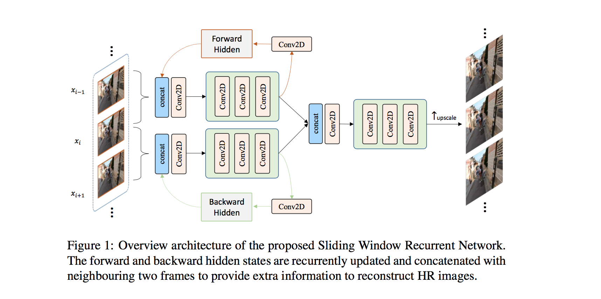

# Sliding Window Recurrent Network for Efficient Video Super-Resolution

### Requirements

- Python: 3.6, 3.7
- Python packages: numpy, imageio and pyyaml 
- [TensorFlow >= 2.6.0](https://www.tensorflow.org/install/) + [CUDA cuDNN](https://developer.nvidia.com/cudnn)
- GPU for training (e.g., Nvidia GeForce RTX 2080)

### Overview Figure



### Dataset preparation

- Download REDS dataset and modify the `data_dir` in config.yml.


### Training and Validation

#### Training

To train the model, use the following command:

```bash
python run.py --process train --config_path config.yml
```

After training, the checkpoints will be produced in `log_dir`.

#### Validation

To valid the model, use the following command:

```bash
python run.py --process test --config_path config.yml
```

After validation, the output images will be produced in `log_dir/output`.


### Testing

To generate testing outputs, use the following command:

```bash
python generate_output.py --model_path model/mobile_rrn.py --model_name MobileRRN --ckpt_path snapshot/ckpt-98 --data_dir /data/dataset/aim22/reds/test/test_sharp_bicubic/X4/ --output_dir results
```
After testing, the output images will be produced in `results`.


### Convert to tflite

To convert the keras model to tflite, use the following command:

```bash
python convert.py --model_path model/mobile_rrn.py --model_name MobileRRN --input_shapes 1,320,180,9:1,320,180,32 --ckpt_path snapshot/ckpt-98 --output_tflite tflite/model.tflite
```

## Citations
If our code helps your research or work, please consider citing our paper.
```
@article{lian2022sliding,
  title={Sliding Window Recurrent Network for Efficient Video Super-Resolution},
  author={Lian, Wenyi and Lian, Wenjing},
  journal={arXiv preprint arXiv:2208.11608},
  year={2022}
}
```


